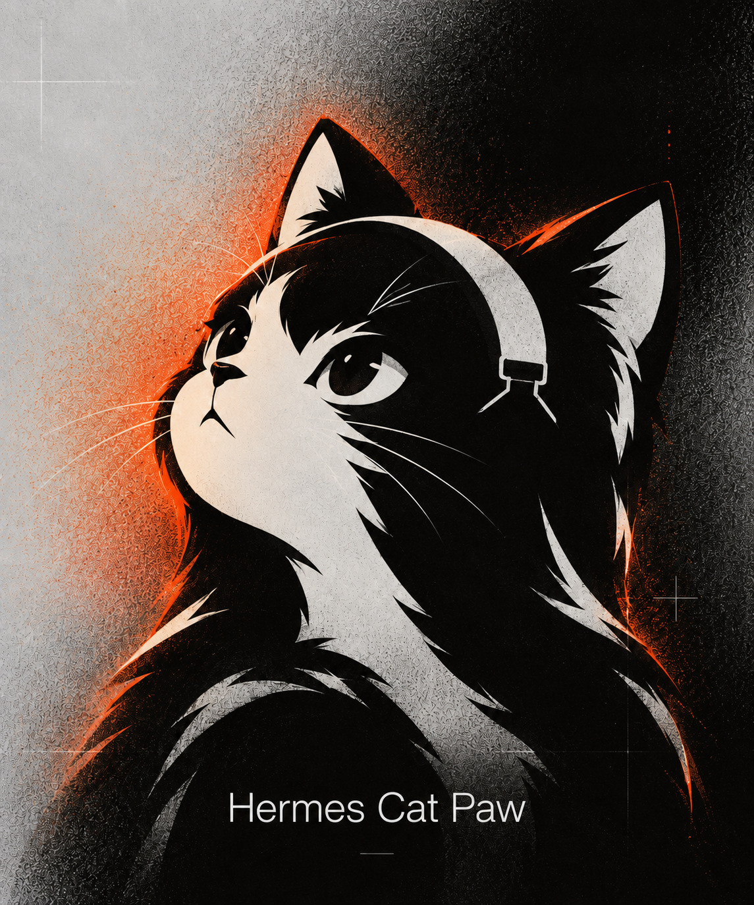
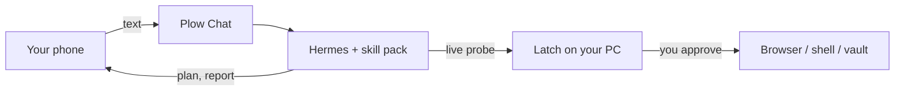
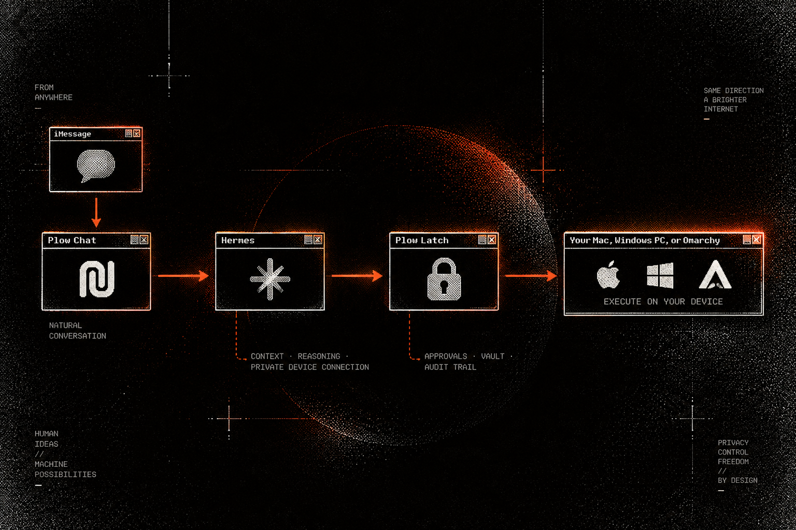
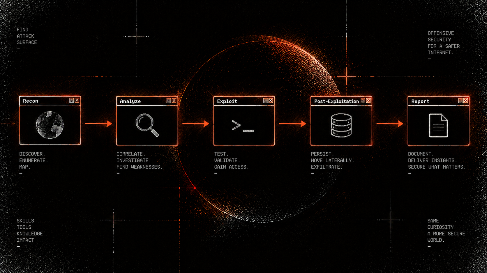
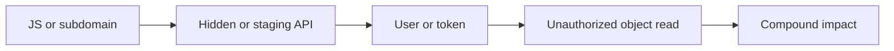
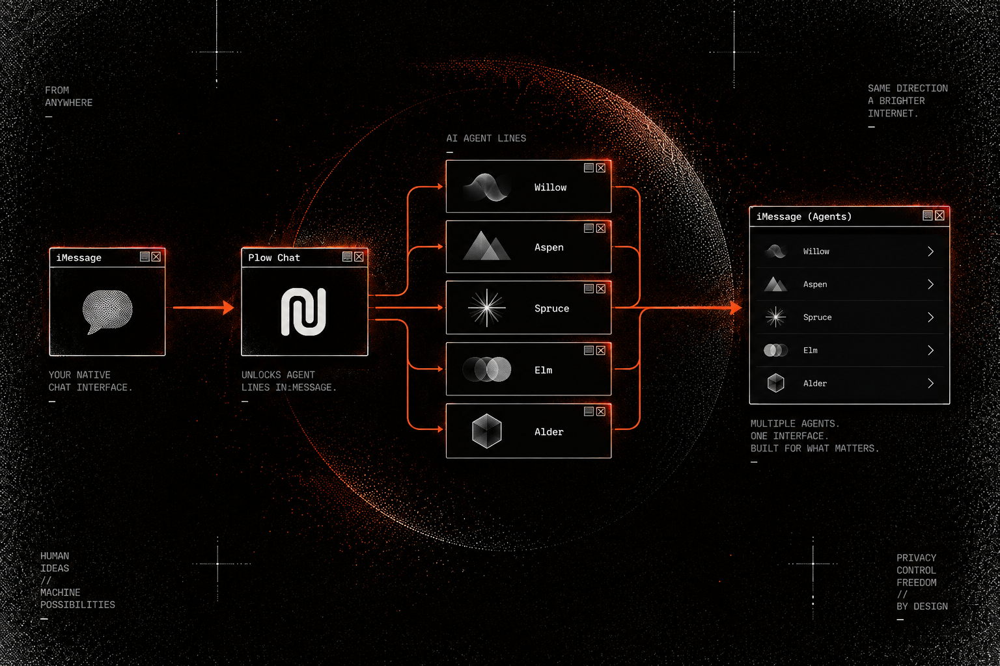

<p align="center">
  
</p>

<h1 align="center">Hermes Cat Paw</h1>

<p align="center">
  Text a recon from your phone.<br />
  Latch asks before anything leaves <em>your</em> computer.
</p>

<p align="center">
  <a href="https://aiworthusing.com/agent-index/hermes-cat-paw"></a>
  <a href="LICENSE"></a>
  <a href="https://github.com/mukul975/Anthropic-Cybersecurity-Skills"></a>
  <a href="https://github.com/kumanaya/cat-paw-latch"></a>
</p>

<p align="center">
  <a href="docs/INSTALL.md">Install</a>
  ·
  <a href="#how-it-works">How it works</a>
  ·
  <a href="#what-you-can-ask">What you can ask</a>
  ·
  <a href="#skill-packs">Skill packs</a>
  ·
  <a href="#why-latch">Why Latch</a>
</p>

> [!IMPORTANT]
> **Authorized testing only.** Own the target, or have it in writing. No permission → no probe. That rule lives in the pack, the installer, and the agent skill.

> [!TIP]
> Start here → **[docs/INSTALL.md](docs/INSTALL.md)**. Pick agent only, Latch only, or both. You can add the other piece later.

---

## How it works

Three parts. You only need the first two to talk. You need the third to *touch* a host.

| Piece | What it is | What it is not |
| --- | --- | --- |
| **Plow Chat** | The phone line. iMessage in, answer out. | Not your computer. |
| **Hermes** | The mind. It loads a playbook and follows it. | Not a silent scanner. |
| **Latch** | The brake. You see the command, then you tap yes or no. | Optional — until a live probe. |



The agent can plan without a computer. It cannot silently scan one.

<p align="center">
  
</p>
<p align="center"><sub>You text. Hermes picks a skill. Latch holds the hop that would actually leave the machine.</sub></p>

---

## What you can ask

Talk like a teammate, not a scanner CLI.

```text
You: We own app.example.com. Written scope is in the thread.
     Start with recon — don't touch auth yet.

Cat Paw: I'll load performing-subdomain-enumeration-with-subfinder,
         then stop before anything state-changing.

         Latch will ask before nmap / the browser session.
```

A normal engagement looks like this:

1. **Confirm scope** in chat (who owns it, what's in, what's out).
2. **Pick a playbook** — discovery first, hunts only after a signal.
3. **Approve live probes** on the desktop (`nmap`, browser, a cookie from a bounty platform).
4. **Keep evidence** on disk you own (`~/Plow` / `$OUTPUT_DIR`).
5. **Report** what was *observed*, *inferred*, *confirmed*, or *not tested*.

Without Latch you can still read the pack, plan, and draft. You must not claim you probed a host from the cloud.

---

## Skill packs

Hermes does not invent a pentest. It opens a playbook and works **that**
objective.

The pack is [mukul975/Anthropic-Cybersecurity-Skills](https://github.com/mukul975/Anthropic-Cybersecurity-Skills)
(Apache-2.0): 818 `SKILL.md` files, 46 `subdomain` labels, mapped to ATT&CK,
NIST CSF, ATLAS, D3FEND, AI RMF, and MITRE F3. Community project — not
affiliated with Anthropic PBC. Install pins a commit and copies `skills/`
into your Hermes home. The playbooks are not baked into the image.

Counted from the pinned checkout (`54a7988`), by `subdomain:` frontmatter:

| Domain | Skills | Reach for it when you need… |
| --- | ---: | --- |
| cloud-security | 66 | AWS, Azure, GCP, CSPM, cloud forensics |
| threat-hunting | 58 | Hypothesis hunts, LOTL, EVTX |
| threat-intelligence | 52 | STIX/TAXII, MISP, actor profiling |
| network-security | 43 | IDS/IPS, traffic, segmentation |
| web-application-security | 42 | OWASP, SQLi, XSS, SSRF, subdomains |
| digital-forensics | 41 | Disk, memory, timelines |
| malware-analysis | 39 | Static/dynamic RE, sandboxes |
| identity-access-management | 37 | Entra ID, phishing, PAM |
| soc-operations | 35 | Playbooks, escalation, tabletops |
| container-security | 33 | K8s RBAC, Falco, image scan |
| red-teaming | 33 | ADCS, BloodHound, C2, relay |
| api-security | 28 | GraphQL, REST, OWASP API |
| ot-ics-security | 28 | Modbus, DNP3, SCADA |
| security-operations | 28 | SIEM, detection engineering |
| incident-response | 26 | Containment, ransomware IR |
| vulnerability-management | 25 | Nessus, CVSS, patch SLAs |
| penetration-testing | 21 | Network, web, cloud, mobile |
| *29 other labels* | 183 | See `cybersecurity-pack` / `--list` |
| **Total** | **818** | |

Start from `conducting-external-reconnaissance-with-osint`,
`performing-subdomain-enumeration-with-subfinder`, or
`performing-web-application-penetration-test`. Add a hunt skill only when
discovery produces a signal. `scripts/install-skills.sh --list` reprints
the full subdomain tally.

<details>
<summary><strong>Load or reload the pack</strong></summary>

```sh
git clone https://github.com/kumanaya/hermes-cat-paw.git
cd hermes-cat-paw
./scripts/install-skills.sh                    # Compose agent
# ./scripts/install-skills.sh --home ~/.hermes  # existing Hermes
```

Windows: `scripts/install-skills.ps1`. Authorized testing only; live probes go through Latch.

</details>

---

## Why this, in this era

Attackers did not invent new sins. They **compressed the old ones**. Exposed services, weak identity, unpatched edge — Rapid7's 2026 landscape still starts there. What changed is the clock: AI scaled recon until the window between “this is on the internet” and “this is being used” is minutes, not weeks.

A single CVE on a dashboard is the wrong picture. Harm lands as a **chain** — one verified behavior feeding the next.

<p align="center">
  
</p>
<p align="center"><sub>Find the path on assets you are allowed to test. Latch is the stop on every hop.</sub></p>

<details>
<summary><strong>Two 2026 shapes of the same chain</strong></summary>

**Identity as the door.** In September 2026, Microsoft tracked passkey-themed phishing that did not stop at the inbox. After the identity fell, operators enrolled *their* MFA, ran Graph reconnaissance (`/users`, `/groups`, `/sites`, `/drives`, `/messages`), then collected SharePoint, OneDrive, and mail. Identity was the door. Cloud APIs were the hallway.

**Publishing identity as the incident.** In August 2026, ChainDrop was a self-propagating npm worm across 400+ packages. It stole developer and CI tokens (npm, GitHub, AWS, Vault), then republished itself. The first package was not the incident. The publishing identity was.

**External web is still how a lot of this begins.** A leaked source map names an internal API. An unauthenticated export dumps ledgers. A staging host holds VPN TOTP seeds. None of those is “critical” alone. Together they are a path from a public JS bundle to a network you thought was inside.

Defense here is not more dashboards. It is seeing that chain on **your** assets first — with permission, with evidence, and with a stop you actually control.

</details>

---

## Attack chains (co-location is not a path)

Several findings on the same host are **not** a chain. The output of step A has to be the input of step B, under the same authorized conditions. [`analyzing-cyber-kill-chain`](https://github.com/mukul975/Anthropic-Cybersecurity-Skills/blob/main/skills/analyzing-cyber-kill-chain/SKILL.md) is the pack's map of that sequence — it does not turn co-located scanner labels into a story.



| “Looks like a path” | What has to be true before you call it one |
| --- | --- |
| Source map → hidden API | The extracted base URL is the API you then tested |
| User enum → IDOR | The enumerated id addresses another *approved* identity's object |
| CORS → protected data | An approved browser session returns non-public data to a controlled origin |
| SSRF → internal service | A callback or response identifies that service |
| Exposed credential → repo | The scoped credential works on an approved test resource |
| WordPress plugin → admin | Upload/write and executable handling are verified, with cleanup |

Label every step: **observed** · **confirmed** · **inferred** · **not tested**. Inferred does not become confirmed because the early steps worked. A skill is a gate, not a script to force the next hop.

Latch sits on the arrows. You see the argv, the origin, the path. You are the scope gate.

---

## Why Latch

Recon is commands, a browser, and credentials. Those do not belong in a datacenter workspace.

<p align="center">
  
</p>

| You get | What that means |
| --- | --- |
| **See it before it leaves** | The approval card shows argv, origin, path. |
| **Your network, not ours** | Bot walls and geo see your IP. Authenticated apps need `plow_browser_open`, not a cloud `fetch`. |
| **Secrets stay in the vault** | `fill_secret` types. The model never reads the value back. |
| **A stop is a stop** | Denial, timeout, MFA, disconnect, host-block. No bypass. |
| **Evidence on disk you own** | `~/Plow` / `${OUTPUT_DIR}`. Latch's audit is append-only. |

<p align="center">
  
</p>
<p align="center"><sub>A Plow line is already waiting on your account — Willow, Aspen, Spruce, Elm, Alder. Cat Paw takes one that's free and keeps it online.</sub></p>

---

## The questions it refuses to skip

If the agent cannot answer these, it must stop.

<details>
<summary><strong>Open the checklist</strong></summary>

<!-- blank line required so GitHub parses the table inside details -->

| Question | Why it matters | How Cat Paw holds it |
| --- | --- | --- |
| Who authorized this target? | Unscoped recon is indistinguishable from crime. AI made it cheap. | No permission in chat → no probe. |
| Is this discovery or validation? | Spray-and-pray burns scope and produces noise. | Playbooks separate the stages. State-changing work needs an explicit yes. |
| Does A actually enable B? | Co-located findings inflate severity. That is how reports lie. | Read the matching pack skill. Require evidence on the transition. |
| Which identity is acting? | 2026 intrusions persist by enrolling *their* MFA. | Relay authenticates the agent. Latch scopes the request. You stay the owner. |
| Where do secrets live? | Tokens and cookies are the payload. Chat is a leak. | Vault on the device. `fill_secret` types; nothing comes back into chat. |
| What leaves this machine? | Cloud fetch is the wrong IP, the wrong bot wall, the wrong evidence. | Live web and scanners run through Latch, after approval. |
| Demonstrated vs inferred? | A `200`, a version string, or an open port is not impact. | Observed / inferred / confirmed / not tested — keep them apart. |
| What is the stop? | Retrying around a timeout is an unscoped scanner. | Denial, timeout, MFA, disconnect, host-block: stop. |
| Where is the evidence? | You cannot reproduce, redact, or defend a finding you didn't keep. | `~/Plow` / `OUTPUT_DIR` plus Latch's append-only audit. |

</details>

If you cannot name the **target**, the **permission**, the **step**, and the **stop**, you are not doing recon. You are hoping.

---

## Security model

The control plane lives on the device you own. Nothing inbound is opened on your network.

| Protected | How |
| --- | --- |
| **Who is acting** | The relay authenticates the agent. Pending work and saved rules key on that identity. |
| **What is allowed** | Acting operations pass a device-local capability check *and* your approval. |
| **Where data lives** | Vault stays on the device. The agent may request a use. It never reads a secret back. |
| **How the device is reached** | Latch connects **out** to Plow. Credentials stay out of URLs and logs. |
| **What changed** | Paths are canonicalized before the prompt. The audit trail is append-only. |

On Windows and Linux, [Cat Paw Latch](https://github.com/kumanaya/cat-paw-latch) adds native hardening: sandboxed command workspaces, presence checks, secrets that never leave the machine. Chat works anywhere you can text. Device control follows the Latch you actually run — upstream on macOS, the fork on Windows and Linux, [Omarchy](https://github.com/omacom/omarchy) as the reference desktop.

---

## Start here

Full guide: **[docs/INSTALL.md](docs/INSTALL.md)**.

| I want | What I get |
| --- | --- |
| [**The agent**](docs/INSTALL.md#agent-only) | Text Hermes from my phone. No desktop app. |
| [**Latch**](docs/INSTALL.md#latch-only) | Approve actions on this computer. |
| [**Both**](docs/INSTALL.md#both) | Phone line + yes/no on this machine. |
| [**I already run Hermes**](docs/INSTALL.md#existing-hermes) | Keep my install. Add the Cat Paw line. |

```sh
git clone https://github.com/kumanaya/hermes-cat-paw.git
cd hermes-cat-paw
# then open docs/INSTALL.md and pick a path
```

---

<p align="center">
  <strong>Authorized recon. Visible permission. Your computer stays yours.</strong>
</p>

<p align="center">
  MIT · <a href="LICENSE">LICENSE</a>
  · playbooks Apache-2.0 © <a href="https://github.com/mukul975/Anthropic-Cybersecurity-Skills">mukul975/Anthropic-Cybersecurity-Skills</a>
</p>
