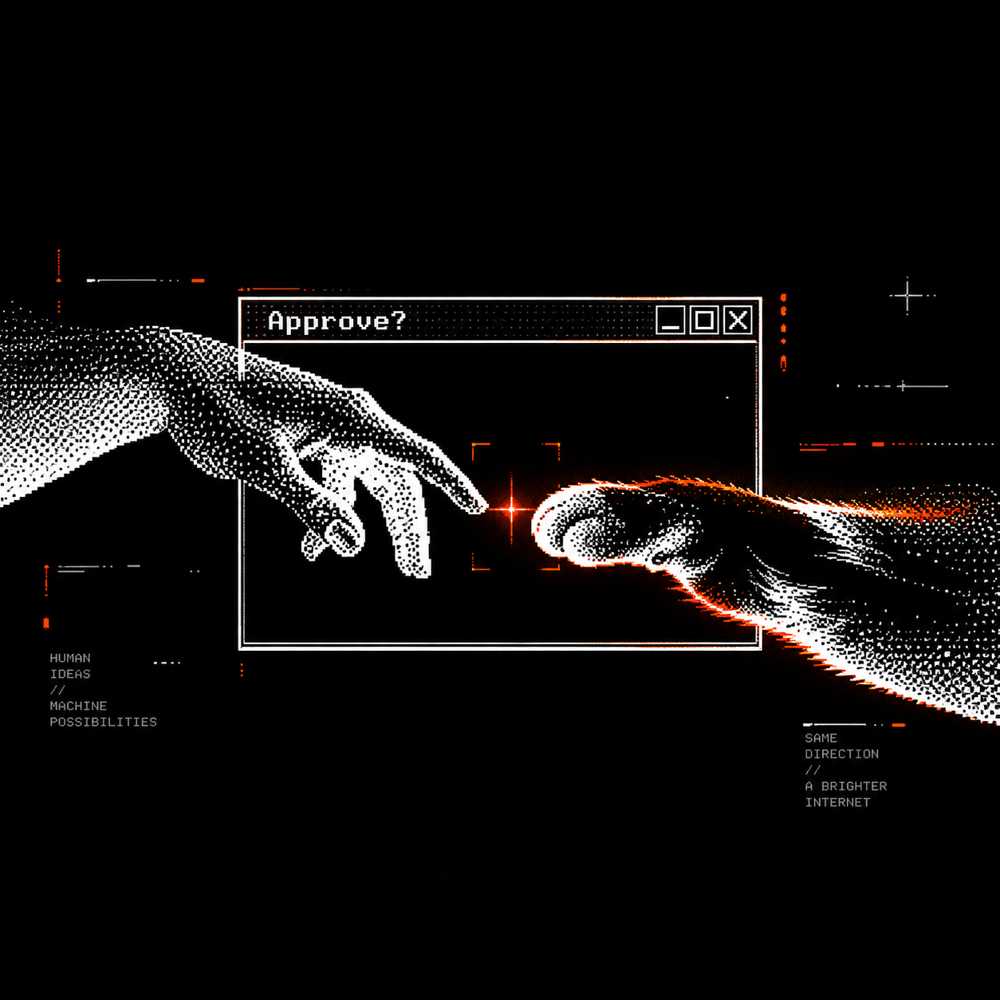

<p align="center">
  
</p>

# Hermes Cat Paw

[](https://aiworthusing.com/agent-index/hermes-cat-paw)
[](LICENSE)

> **Install:** [docs/INSTALL.md](docs/INSTALL.md) · **Device fork:** [Cat Paw Latch](https://github.com/kumanaya/cat-paw-latch)

## Your AI can act. You stay in control.

Hermes Cat Paw gives your AI a connection to the computer you own. It works
with Plow Chat, Hermes, and Latch so an agent can inspect, propose, and act
across Windows, Linux, and Omarchy — while every meaningful action remains
visible to you.

It is a small, focused setup for personal computer control. The agent can have
capability without having silent permission.

> **Private by design.** Your device connection and Plow line belong to you.
> Your existing Hermes skills remain yours.

## Work from your phone. Keep control at your computer.

<p align="center">
  
</p>

**Plow Chat** is the conversation. **Hermes** selects the right skill and orchestrates the work. **Latch** is the line between an agent's intent and your actual device.

The cloud agent is not your computer. Hermes Cat Paw keeps that boundary
visible.

## The connection between intent and action

Hermes Cat Paw is the product layer that brings the pieces together. It uses
**my version of Plow Latch** as the device-side control plane, with first-class
support for **Windows and Linux** and Omarchy as the primary Linux experience.

Latch fork: [github.com/kumanaya/cat-paw-latch](https://github.com/kumanaya/cat-paw-latch)

Build the fork from source before starting. The fork provides the Windows/Linux
packaging and hardening used by Hermes Cat Paw; it ships no installer, so a
checkout is the whole install.

### Omarchy, in the real world

The ideal first run is simple: connect the device, show one available
capability, approve one harmless visible action, and verify the result on
Omarchy. Do not include secrets, tokens, private files, or approval-bypass
states in screenshots.

---

## Autonomy needs a brake.

<p align="center">
  
</p>

AI can click through a browser, run commands, send a message, and touch the systems where your real life happens. The dangerous failure is not an agent that cannot act. It is an agent that acts too confidently, too quickly, and without you seeing what changed.

Plow Latch makes approval part of the workflow:

- **See the action before it happens.** Device work is expressed as a concrete intent and evaluated on your machine.
- **Approve the capability, not a vague promise.** You can ask every time or keep a rule for an exact, repeatable action.
- **A past "yes" is not a permanent yes.** A learned procedure is a hint. It never creates a new permission.
- **A stop is a stop.** Denial, timeout, MFA, a disconnected device, or a changed account ends the flow. The agent does not route around it.
- **Verify, then report.** A successful tool call is not proof that the outcome happened. The agent checks visible evidence where it can.

This is how automated work should feel: fast when it is safe, deliberate when it matters.

## Security is not a checkbox.

Latch keeps the control plane on the device you own.

| What is protected | How the boundary works |
| --- | --- |
| **Who is acting** | The relay authenticates the agent. Pending work, deferred results, and saved rules are scoped to that identity. |
| **What is allowed** | Acting operations go through a device-local capability decision and an approval policy. |
| **Where data lives** | Vault data stays on the device. The agent may request an approved use, never read or repeat a secret in chat. |
| **How the device is reached** | Latch connects outbound to Plow. Your computer does not need to expose an inbound service. Relay credentials stay out of URLs and are redacted from logs. |
| **What changed** | Latch canonicalizes paths before approval and audit, and records an append-only audit trail. |

On Windows and Linux, use the Latch fork with native hardening: [kumanaya/cat-paw-latch](https://github.com/kumanaya/cat-paw-latch) (alternative to upstream [plow-pbc/latch](https://github.com/plow-pbc/latch)). On Windows it adds a Job Object plus AppContainer-backed command workspaces with process limits and fail-closed enforcement, Windows Credential Manager/DPAPI support for vault keys, owner-only secret-file ACLs, and Windows Hello or password presence for sensitive work. On Linux it adds Bubblewrap-backed command workspaces, session-unlock presence checks, Secret Service-backed storage, host-gate diagnosis, and AppImage packaging with release-feed digest validation.

Security claims deserve precision. Latch's documented macOS command sandbox has a broad read allowance for the owner's home directory; a shell approval is therefore a high-trust decision. Prefer a dedicated, least-powerful Latch tool, keep network access off unless needed, and read the actual approval prompt.

---

## One context skill. Your Hermes stays yours.

This repository does not replace your Hermes configuration. The single context
skill explains how Plow Chat, Hermes, and Latch fit together; your existing
Hermes installation remains the source of truth for skills and workflows.

| Skill | Use it for |
| --- | --- |
| [`hermes-cat-paw-context`](skills/hermes-cat-paw-context/SKILL.md) | Explains Hermes Cat Paw, Plow Chat, Hermes, Latch approvals, and the Windows/Linux/Omarchy flow. |

If an owner needs a workflow, use the skills already installed in their Hermes
environment. If the Plow Chat plugin is missing, install the official plugin
for that Hermes version; this repository is not a plugin replacement.

```text
skills/
└── hermes-cat-paw-context/  # explain the product and approval boundary
```

### Try Hermes Cat Paw

> “Explain how Hermes Cat Paw, Plow Chat, Hermes, and Latch work together.”

> “Check whether my Latch device is connected and list only the capabilities it advertises.”

> “Show me a safe, visible Hermes Cat Paw action on Omarchy and stop at the approval prompt.”

---

## Start in a few minutes.

The public ranking is the **Agent Index**, not GitHub. Hermes Cat Paw registers
the identity `hermes-cat-paw` and reports aggregate model-token usage from each
persistent installation hourly. The reporter sends no prompts, task text, paths,
or secrets. Keep the Compose volume named `hermes-cat-paw-home`; deleting it
creates a new installation identity and splits the usage history.

After a real conversation, verify the reporter with:

```sh
docker compose logs --tail=100 hermes-cat-paw
docker compose exec hermes-cat-paw /opt/hermes/.venv/bin/python3 /opt/plow/agent-index-client.py --self-check
docker compose exec hermes-cat-paw /opt/hermes/.venv/bin/python3 /opt/plow/agent-index-client.py --agent hermes-cat-paw --dry-run
```

Publishing the repository alone does not create a ranking entry. The container
must boot with a legitimate Plow credential, complete a real conversation, and
successfully register/report. Do not manufacture installations or share
credentials.

Use the complete Hermes setup, connect Plow Chat to an existing Hermes
installation, or give any MCP-capable harness a permissioned connection to
Latch.

### First: build the Latch device app

For the Omarchy or Windows demo, prepare Latch from this repository, then
launch it on the computer you want Hermes to control:

```sh
./scripts/setup-latch.sh   # Linux/Omarchy
cd ../cat-paw-latch && just app
```

On Omarchy, a packaged AppImage also lands in the Apps tab:

```sh
cd ../cat-paw-latch
just package-linux         # build + install-desktop
# or just install-desktop  # if the AppImage is already in apps/desktop/release/
```

Then open the Apps tab and look for **Cat Paw Latch**. If it is missing,
`omarchy restart shell`.

On Windows, run `.\scripts\setup-latch.ps1` then `just app` in the Latch
checkout. `setup-latch` clones [kumanaya/cat-paw-latch](https://github.com/kumanaya/cat-paw-latch)
if needed and runs `just install` so Electron is actually downloaded.

Sign in, leave Latch running, and complete its device connection. Keep the
approval window visible during the demo. The Latch app is the device-side
component; this repository does not copy or replace it.

### Run the complete Hermes + Plow setup

Hermes Cat Paw provides the connection context and safe credential handoff. Your
Hermes installation remains the owner of its persona, plugins, and operational
skills.

1. Install the official `plow-agents` CLI once. This provisions the Plow Chat
   agent; it does not install Latch:

   Requirements: Git, Python 3, and Docker Compose. Linux users need Docker
   Engine with the Compose plugin; Windows users need Docker Desktop with the
   WSL 2 engine enabled.

   ```sh
   git clone https://github.com/plow-pbc/plow-agents.git
   export PATH="$PWD/plow-agents/bin:$PATH"
   ```

   On Windows PowerShell:

   ```powershell
   git clone https://github.com/plow-pbc/plow-agents.git
   $plowAgents = "$(Get-Location)\plow-agents\bin\plow-agents"
   ```

2. On Linux, log in. Skip this if `~/.config/plow/token` already exists.

   ```sh
   plow-agents login
   plow-agents lines
   ```

   Use `login --new-line` only when you want Plow to create another assistant
   line. If a line is already free, mint that one instead of provisioning a
   new number.

   On Windows, prefix those commands with `python $plowAgents`:

   ```powershell
   python $plowAgents login
   python $plowAgents lines
   ```

3. Mint the credential file for a free line (name or uid). Occupied lines
   such as a cloud agent cannot be minted until that assistant is deleted in
   Plow:

   ```sh
   plow-agents mint <line-uid>
   ```

   The repo installer selects a free line and always boots with
   `AGENT_ID=hermes-cat-paw`:

   ```sh
   ./scripts/install.sh                 # first free line, product AGENT_ID
   ./scripts/install.sh --line Willow   # choose a free line by name
   ./scripts/install.sh --new-line      # only to create another line
   ```

   On Windows:

   ```powershell
   python $plowAgents mint <line-uid>
   .\scripts\install.ps1
   .\scripts\install.ps1 -Line Willow
   .\scripts\install.ps1 -NewLine
   ```

   This creates `./plow-credentials`. It is mounted into the container by
   `compose.yml`; do not rename it, commit it, or paste its contents into chat.

4. Start the agent:

   ```sh
   docker compose up --build -d
      docker compose logs -f hermes-cat-paw
   ```

The credential is for your Plow line. It is not a dashboard session, Latch credential, or MCP URL. The base image reads the mounted credential file and resolves the agent identity at boot.

Open the [Plow Dashboard](https://app.plow.co/dashboard) afterwards. Your line should appear **Online** and the dashboard shows usage, balance, model spend, connected accounts, and your Latch MCP URL.

### Add Plow Chat to a Hermes you already run

Already have a Hermes agent, a favorite persona, and a home you do not want to replace? Use the prompt below for a read-only first look. It helps your agent identify what is already installed before suggesting any setup.

```text
I already use Hermes and want to understand whether Plow Chat is available in my current installation.

First, perform a read-only inspection of the local Hermes version, installed plugins, and relevant configuration names. Do not open a login flow, change a file, install anything, restart a service, or read secret values. Tell me clearly what is already present and what is missing.

If the Plow Chat plugin is already installed, explain the next safe step to connect it to Plow. If it is missing, show me the official installation documentation for my Hermes version and wait for my confirmation before doing anything. Preserve my existing persona, skills, sessions, provider settings, and configuration. Never print, copy, or request tokens, passwords, cookies, or other secrets.
```

This prompt is intentionally diagnostic first. Setup only happens after the owner understands the current installation and explicitly asks to continue.

### Give your existing harness a Latch connection

Use this route for any MCP-capable harness. The harness chooses its own supported connection method; this does not install a new Hermes or give it a raw device credential.

1. Install and sign into Plow Latch on the device you own. Keep it running. Upstream is [plow-pbc/latch](https://github.com/plow-pbc/latch); for Windows and Linux use the fork [kumanaya/cat-paw-latch](https://github.com/kumanaya/cat-paw-latch).
2. In the Plow Dashboard, copy the **MCP URL** for that device.
3. Paste this prompt into your harness, replacing `<YOUR_LATCH_MCP_URL>` only.

```text
Connect this harness to my Plow Latch MCP server at:
<YOUR_LATCH_MCP_URL>

Use your harness's own documented MCP configuration for a remote HTTP server and complete its authentication flow when prompted. Choose the appropriate private/user scope offered by the harness. Do not put an OAuth client ID or client secret in the configuration unless Plow explicitly provides one; do not create or paste a static API key, device credential, or dashboard cookie. Keep the MCP URL out of version control.

After connecting, list the available plow_ tools and perform only a read-only device-status or skill-list check. Explain the capabilities that Latch actually advertises. Do not run commands, open a browser session, access the vault, or change a device setting until I make a separate request and approve it in Latch. Never use a skip-permissions mode.
```

The harness owns the transport and authentication details. Follow its MCP documentation for completing the browser or OAuth flow after adding the server.

> The dashboard MCP URL is a connector URL, not a Plow Chat token. It never belongs in this repository's credentials.

---

## Built for the desktop you actually use.

| Platform | Status |
| --- | --- |
| **macOS** | Supported by the upstream Latch implementation ([plow-pbc/latch](https://github.com/plow-pbc/latch)). |
| **Windows** | Supported by the fork ([kumanaya/cat-paw-latch](https://github.com/kumanaya/cat-paw-latch)), including Windows-specific security controls. |
| **Linux / Omarchy** | Supported by the fork ([kumanaya/cat-paw-latch](https://github.com/kumanaya/cat-paw-latch)), with the same approval, vault, relay, and audit principles. |

[Omarchy](https://github.com/omacom/omarchy) is Hermes Cat Paw's reference
environment: an opinionated, agentic Linux desktop where a powerful personal
agent remains on the right side of a visible human decision. The context must
discover what Latch advertises; it must never assume a macOS or Windows
capability is available on Omarchy.

## Inside the repository

- [skills/](skills/) — the integration context skill.
- [scripts/setup-latch.sh](scripts/setup-latch.sh) / [setup-latch.ps1](scripts/setup-latch.ps1) — clone and `just install` Cat Paw Latch.
- The base Hermes image provides Hermes and the Plow Chat plugin; this repository does not replace either one.
- `plow-credentials` — generated by `plow-agents mint` and mounted read-only into the base image.

---

**Real autonomy. Visible permission. Your computer stays yours.**

Hermes Cat Paw is MIT licensed. See [LICENSE](LICENSE).
