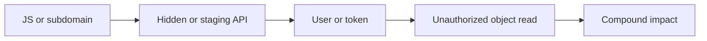

<p align="center">
  
</p>

# Hermes Cat Paw

[](https://aiworthusing.com/agent-index/hermes-cat-paw)
[](LICENSE)

> **Install:** [docs/INSTALL.md](docs/INSTALL.md) · **Recon pack:** [uphiago/recon-skills](https://github.com/uphiago/recon-skills) · **Device:** [Cat Paw Latch](https://github.com/kumanaya/cat-paw-latch)

## Text a recon. Latch holds the brake.

Hermes Cat Paw is an agent you reach from your phone, loaded with **skill
packs per segment**. The first pack is authorized reconnaissance — subdomain
and web discovery, auth and API hunting, evidence, reporting.

**Plow Chat** is the line. **Hermes** picks the skill. **Latch** is how
anything that touches a real host, a real browser, or a real secret gets
your yes on the computer you own.

The agent can plan without a computer. It cannot silently scan one.

> **Authorized testing only.** The recon pack is for targets you own or have
> written permission to test. That rule is in the pack, in the installer, and
> in the agent skill. No permission → no probe.

> **Private by design.** Your Plow line belongs to you. Pack skills stay in
> your Hermes home. A device connection is yours to add, or to skip.

## Skill packs, by segment

Hermes does not invent a pentest. It loads a playbook, then works the
objective that playbook owns.

| Segment | What the agent follows |
| --- | --- |
| **Recon** | Subdomains, ports, HTTP, JS, APIs, staging hosts |
| **Auth** | Sessions, OAuth, SAML, MFA |
| **Infra** | Cloud, containers, exposed services |
| **Red team** | Vulnerability-class hunts, triage, reports |
| **Chains** | Evidence-backed attack paths |
| **Meta** | Engagement planning and the recon playbook |

The playbooks are [Hiago's recon-skills](https://github.com/uphiago/recon-skills)
(MIT). `scripts/install-skills.sh` pins a commit and copies them into Hermes.
They are not vendored here, so the pack can move without a product rewrite.

Start from `meta/recon-playbook`, `redteam/web2-recon`, or
`recon/subdomain-enumeration`. Add a hunt skill only when discovery produces
a signal.

## Why you defend in this era.

Attackers did not invent new sins. They compressed the old ones. Rapid7's
2026 threat landscape puts it plainly: most successful intrusions still
start from exposed services, weak identity, and unpatched edge. What changed
is the clock. AI scaled reconnaissance and social engineering until the
window between “this is on the internet” and “this is being used” is
minutes, not weeks.

That is why a single CVE on a dashboard is the wrong picture. Harm lands as
a **chain**: one verified behavior feeding the next.

In September 2026, Microsoft tracked passkey-themed phishing that did not
stop at the inbox. After the identity fell, operators enrolled their own
authentication methods, ran Graph reconnaissance (`/users`, `/groups`,
`/sites`, `/drives`, `/messages`), then collected SharePoint, OneDrive, and
mail. Identity was the door. Cloud APIs were the hallway.

In August 2026, ChainDrop showed the same shape in the supply chain: a
self-propagating npm worm across 400+ packages, stealing developer and CI
tokens (npm, GitHub, AWS, Vault), then republishing itself. The first
package was not the incident. The publishing identity was.

External web is still how a lot of this begins. A leaked source map names
an internal API. An unauthenticated export dumps ledgers. A staging host
holds VPN TOTP seeds. None of those is “critical” alone. Together they are
a path from a public JS bundle to a network you thought was inside.

Defense in this era is not more dashboards. It is seeing the chain on
**your** assets before someone else walks it — with permission, with
evidence, and with a stop you actually control.

<p align="center">
  
</p>

## Attack chains. Co-location is not a path.

The pack's `chains/` skills exist so the agent cannot promote a pile of
scanner labels into a story. [`cross-attack-chains`](https://github.com/uphiago/recon-skills/blob/main/chains/cross-attack-chains/SKILL.md)
is explicit: several findings on the same host are not a chain unless the
**transition** is demonstrated. The output of step A must be the input of
step B, under the same authorized conditions.



Transitions the pack knows how to **prove**, not assume:

| Candidate path | What has to be true |
| --- | --- |
| Source map → hidden API | The extracted base URL is the API you then tested |
| User enum → IDOR | The enumerated id addresses another *approved* identity's object |
| CORS → protected data | An approved browser session returns non-public data to a controlled origin |
| SSRF → internal service | A callback or response identifies that service |
| Exposed credential → repo | The scoped credential works on an approved test resource |
| WordPress plugin → admin | Upload/write and executable handling are verified, with cleanup |

Each step is labeled: **observed**, **confirmed**, **inferred**, or **not
tested**. Inferred does not become confirmed because the early steps
worked. [`wordpress-full-compromise`](https://github.com/uphiago/recon-skills/blob/main/chains/wordpress-full-compromise/SKILL.md)
is a gate, not a script to force escalation when a prerequisite failed.

Latch sits on the arrows. A live probe that would walk the next hop is an
intent on your computer. You see the argv, the origin, the path. You are
the scope gate. The pack does not get a silent second request.

## Questions this project forces.

These are the cybersecurity questions Hermes Cat Paw is built to keep in
the open. If the agent cannot answer them, it must stop.

| Question | Why it matters now | How this project holds it |
| --- | --- | --- |
| **Who authorized this target?** | Unscoped recon is indistinguishable from crime, and AI makes it cheap. | No permission in chat → no probe. The pack, the installer, and `recon-pack` all say so. |
| **Is this discovery or validation?** | Checklists that spray requests without changing a decision are noise — and they burn scope. | Pack skills separate the stages. State-changing work needs an explicit yes. |
| **Does A actually enable B?** | Co-located findings inflate severity. That is how reports lie. | `cross-attack-chains` requires evidence on the transition. |
| **Which identity is acting?** | 2026 intrusions persist by enrolling *their* MFA, not by dropping malware. | The relay authenticates the agent. Latch scopes pending work to that identity. You are still the owner. |
| **Where do secrets live?** | Tokens and cookies are the payload (Graph, npm, CI). Chat is a leak. | Vault on the device. `fill_secret` types; the model never reads the value back. |
| **What leaves this machine?** | Cloud fetch is the wrong IP, the wrong bot wall, and the wrong evidence. | Live web and scanners run through Latch on your network, after approval. |
| **What was demonstrated vs inferred?** | A 200, a version string, or an open port is not impact. | Observed / inferred / confirmed / not tested. Reports must keep those apart. |
| **What is the stop?** | An agent that retries around a timeout is an unscoped scanner. | Denial, timeout, MFA, disconnect, host-block: stop. No bypass. |
| **Where is the evidence?** | Without artifacts you cannot reproduce, redact, or defend the finding. | `~/Plow` / `OUTPUT_DIR` on disk you own. Latch's audit log is append-only. |

If you cannot name the target, the permission, the step, and the stop, you
are not doing recon. You are hoping. This product is for the first of those.

## Why Latch is the point of recon, not an add-on.

Recon is commands, a browser, and credentials. Those do not belong in a
datacenter workspace.

<p align="center">
  
</p>

You text the line. Hermes reads the pack. If the next step is live — `nmap`,
a browser on the target, a cookie from a bounty platform — Latch turns it
into a concrete intent on **your** machine.

- **See the probe before it leaves.** The approval card shows the argv, the
  origin, the path. You are the scope gate.
- **Run on your network, not ours.** Bot walls and geo see your IP. JS
  bundles and authenticated apps need a real browser (`plow_browser_open`),
  not a cloud `fetch`.
- **Secrets never enter chat.** Vault items fill in the page. The model
  never reads them back.
- **A stop is a stop.** Denial, timeout, MFA, disconnect, or a host block
  ends the flow. The pack does not get a bypass.
- **Evidence stays on disk you control.** Artifacts go under `~/Plow` /
  `${OUTPUT_DIR}`. Latch writes an append-only audit of what ran.

Without Latch, the agent can still read the pack, plan the engagement, and
draft the report. It must not claim it probed a host from the cloud.

## Work from your phone. Keep control at your computer.

<p align="center">
  
</p>

A Plow line is a named assistant already waiting on your account — Willow,
Aspen, Spruce, Elm, Alder. Hermes Cat Paw takes one that is still free and
keeps it online. You text from iMessage. The skill pack does the thinking.
You tap yes or no on the desktop.

<p align="center">
  
</p>

## Security is not a checkbox.

The control plane lives on the device you own. The agent asks. You decide.
Nothing inbound is opened on your network.

| What is protected | How the boundary works |
| --- | --- |
| **Who is acting** | The relay authenticates the agent. Pending work and saved rules are scoped to that identity. |
| **What is allowed** | Acting operations pass a device-local capability decision and an approval policy. |
| **Where data lives** | Vault data stays on the device. The agent may request an approved use. It never reads a secret back into chat. |
| **How the device is reached** | Latch connects outbound to Plow. Credentials stay out of URLs and are redacted from logs. |
| **What changed** | Paths are canonicalized before approval. An append-only audit trail records the rest. |

On Windows and Linux, [Cat Paw Latch](https://github.com/kumanaya/cat-paw-latch)
adds native hardening — sandboxed command workspaces, presence checks, and
secrets that never leave the machine.

Chat works anywhere you can text the line. Device control follows the Latch
you run: upstream on macOS, the fork on Windows and Linux, with
[Omarchy](https://github.com/omacom/omarchy) as the reference desktop.

---

## Start here.

The full guide is [docs/INSTALL.md](docs/INSTALL.md). Pick a path — agent
only, Latch only, or both. The agent installer loads the recon pack after
the line is up. To load it again later:

```sh
git clone https://github.com/kumanaya/hermes-cat-paw.git
cd hermes-cat-paw
./scripts/install-skills.sh          # Compose agent
# ./scripts/install-skills.sh --home ~/.hermes   # existing Hermes
```

Then open the install guide.

---

**Authorized recon. Visible permission. Your computer stays yours.**

Hermes Cat Paw is MIT licensed. See [LICENSE](LICENSE). The recon playbooks
remain MIT © [uphiago/recon-skills](https://github.com/uphiago/recon-skills).
