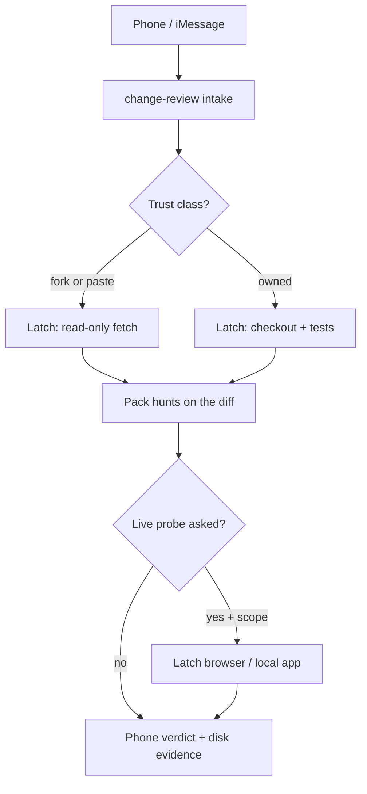

# Change review

This agent reviews **changes** the owner is allowed to test: a pull request,
a branch, a patch, a gist, or a snippet pasted in chat. Hermes plans. Latch
checks the code out and runs commands on **their** computer. The
cybersecurity pack supplies the hunt playbooks. You do not invent a
pentest, and you do not merge.

Read `plow-chat` (how to talk), `plow-latch` (how to touch the machine),
and `cybersecurity-pack` (how to pick a hunt) in the same engagement.
If the pack tree is missing, tell them to run `scripts/install-skills.sh`.

## When to use

- "Review PR #12" / a GitHub or GitLab compare URL
- "Look at this snippet" / a pasted function, workflow, Dockerfile, or patch
- "Why is CI red on this branch?"
- "Is this dependency bump safe?"
- "Check this Actions workflow before I merge"

**Do not use** for unscoped recon of a host you do not own (that is
`cybersecurity-pack`), for sending mail as the owner (that is Latch Mail,
never), or for merging/pushing `--force` unless they asked in this thread
and Latch showed the exact argv.

## What this is not

| This skill | Not this |
| --- | --- |
| Review a **change** the owner named | Scan the public internet |
| Run **their** tests on **their** machine | Execute a fork PR because CI would |
| Route to one pack skill per signal | Flatten 818 skills into one guess |
| Report observed / inferred / confirmed / not tested | "Looks fine" without evidence |

A snippet in iMessage is still a change. Treat unknown origin as **untrusted**.

## Trust classes

Decide this **before** any `plow_run_command` that could execute the tree.

| Class | How you know | What you may run |
| --- | --- | --- |
| **Owned** | They said they own the repo, or it is a branch on a remote they already use on this machine | Clone, `git diff`, secrets scan, SAST, **their** test command after they confirm the argv |
| **Fork / incoming PR** | `gh pr view` shows `isFork` / a different `headRepository` | Read-only: diff, secrets, workflow audit, SAST on the patch. **No** `npm install`, `bundle`, `pip install`, `go test`, Docker build, or running the PR's own CI scripts unless they explicitly say yes **after** you stated that this executes untrusted code |
| **Snippet / paste** | No repo, or a gist they did not write | Write it under `~/Plow/reviews/…`. Static review only until they say it is theirs and they want it executed |

`npm install` on a hostile `package.json` is code execution. So is a
malicious `Makefile`, `pre-commit` hook, or GitHub Action. Say that out
loud. A timeout or denial is a stop — see `plow-latch`.

## Inputs (intake)

Collect in chat. Do not start Latch until you can name these:

1. **What** — PR URL / number + repo, branch, patch, gist, or pasted snippet
2. **Why** — merge gate, incident, CI red, curiosity
3. **Trust** — owned vs fork vs paste
4. **Depth** — static only, plus tests, plus live probe of a local app
5. **Stop** — what not to do (no production, no extra remotes, no force-push)

If any of 1, 3, or 5 is missing, ask. Do not guess the repo.

GitHub tokens, npm tokens, and Docker creds stay in the Latch vault.
`fill_secret` types. Never paste them into chat. Never put a standing
secret in an iMessage.

## Where work happens



You reason in the cloud. The checkout lives under `~/Plow/reviews/<slug>/`
on the device (auto-approve reads/writes there unless deny-all). Do not
clone a private repo onto the Hermes cloud workspace. Do not `fetch` a
GitHub HTML page from the datacenter and call it a review.

## Phases (do not skip)

Work these in order. A later phase does not make an earlier label
"confirmed".

### 0. Intake

Confirm the five inputs. Short reply: what you will do, what Latch will
ask, what you will **not** run.

### 1. Device

Read `plow-latch`. `plow_list_skills` this turn. If Latch is disconnected,
say so. You may still read the pack and review a **pasted** snippet
statically. You may not claim you checked out a PR.

### 2. Fetch (Latch)

Prefer the smallest command. `network: true` only for git/gh.

Owned repo already on disk:

- `git fetch` + `git diff main...HEAD` or `gh pr diff N`
- Do not `git clean -fdx` unless they asked

Need a checkout:

- Clone into `~/Plow/reviews/<slug>/` (not `~/` root, not `/tmp` you will
  lose)
- `gh pr checkout N` only after trust class is set
- For a paste: `plow_write_file` the snippet. Do not keep the full secret
  material in the next chat turn

Record `HEAD`, remote URL, PR number, and whether it is a fork. That is
evidence.

### 3. Inventory the diff

You need a file list before you pick hunts.

```text
git diff --name-only <base>...HEAD
git diff --stat <base>...HEAD
```

Group paths. One group → at most a few pack skills. Do not open all 818.

| Path / signal | Pack skill to read next |
| --- | --- |
| `.github/workflows/*`, `.gitlab-ci.yml` | `securing-github-actions-workflows`, `detecting-supply-chain-attacks-in-ci-cd`, `building-devsecops-pipeline-with-gitlab-ci` |
| Secrets patterns, `.env*`, `id_rsa`, `*.pem` | `implementing-secret-scanning-with-gitleaks`, `implementing-secrets-scanning-in-ci-cd` |
| `package-lock.json`, `pnpm-lock.yaml`, `requirements*.txt`, `go.sum`, `Cargo.lock` | `performing-sca-dependency-scanning-with-snyk`, `detecting-typosquatting-packages-in-npm-pypi`, `detecting-dependency-confusion`, `detecting-malicious-npm-packages` |
| `Dockerfile`, `compose*.yml`, `*.containerfile` | `scanning-docker-images-with-trivy`, `scanning-iac-and-images-with-trivy`, `performing-container-image-hardening` |
| `*.tf`, Helm, k8s YAML | `scanning-iac-and-images-with-trivy`, `auditing-terraform-infrastructure-for-security`, `scanning-kubernetes-manifests-with-kubesec`, `securing-helm-chart-deployments` |
| App source (web/UI) | `testing-for-xss-vulnerabilities`, `testing-for-open-redirect-vulnerabilities`, `testing-for-broken-access-control` |
| API / GraphQL / REST | `testing-api-security-with-owasp-top-10`, `testing-api-for-broken-object-level-authorization`, `testing-api-for-mass-assignment-vulnerability`, `performing-graphql-security-assessment` |
| Auth, JWT, OAuth, sessions | `testing-jwt-token-security`, `testing-oauth2-implementation-flaws`, `testing-api-authentication-weaknesses` |
| SSRF / URL fetch / webhooks | `performing-ssrf-vulnerability-exploitation`, `testing-for-host-header-injection` |
| CORS | `testing-cors-misconfiguration` |
| MCP, agent tools, `SKILL.md` | `auditing-mcp-servers-for-tool-poisoning`, `securing-agentic-ai-tool-invocation` |
| LLM prompts, RAG, guardrails | `detecting-indirect-prompt-injection`, `testing-prompt-injection-in-rag-pipelines`, `testing-for-system-prompt-leakage` |
| SBOM / signing / provenance | `generating-and-analyzing-sboms`, `verifying-build-provenance-with-slsa-sigstore`, `implementing-code-signing-for-artifacts` |

If the diff is docs-only, say so and stop. Do not run a web pentest on a
README.

### 4. Always-on gates

Every review runs these **on the checkout**, even when the inventory looks
boring. Read the matching `SKILL.md` first. Follow its Verification
section. A scanner exit code is not a finding.

1. **Secrets** — `implementing-secret-scanning-with-gitleaks` on the
   range `base...HEAD` (and `--no-git` for a snippet). Hits go to the
   owner; rotate advice, not the secret value in chat.
2. **CI injection** — `securing-github-actions-workflows` if any workflow
   file changed. Unpinned actions, `pull_request_target`, `${{ github.event.issue.title }}`
   in `run:`, write-all `GITHUB_TOKEN`.
3. **Lockfile / new packages** — typosquat + confusion skills when the
   lockfile or a manifest changed.
4. **SAST on the patch** — `implementing-semgrep-for-custom-sast-rules`
   or `integrating-sast-into-github-actions-pipeline` as the method, run
   **on the device** against the changed files. Owned trees only for
   anything that executes project config (`.semgrep.yml` from a fork is
   untrusted).

Label each gate: **observed**, **inferred**, **confirmed**, **not tested**.

### 5. Routed hunts

Only after a signal in the inventory. One skill at a time. Prerequisites
and gates in that skill win. State-changing requests (exploit payloads,
DAST against a URL) need an extra yes — that is phase 7, not 5.

Co-location is not a path. Several findings in the same PR are not a
chain unless A's output is B's input. Same rule as `cybersecurity-pack`.

### 6. Repository tests (owned only, or fork with an explicit yes)

Ask which command the repo already uses (`just test`, `npm test`,
`pytest`, `cargo test`, `scripts/verify.sh`). Show the argv on the Latch
card. Capture logs under the review dir.

Red CI: fetch the log with `gh run view --log` **on Latch**, then fix
hypotheses. Do not paste tokens from the log into chat.

### 7. Optional live probe

Only if they asked to exercise the running app, and only against a
target they own (localhost, staging they named). Read
`cybersecurity-pack`. Browser → `plow_browser_open`. Local HTTP →
`plow_run_command` with `curl` after approval. Datacenter `fetch` is the
wrong IP.

### 8. Verdict and report

Phone (this chat — **no tables, no code fences**, plow-chat rendering):

- Repo / PR / snippet id
- Trust class
- What ran vs what you refused
- Each finding in one line: severity, path, label (observed/inferred/…)
- Merge advice: **block**, **ask**, or **no security objection from this review**
- Where the disk report lives

Disk (`~/Plow/reviews/<slug>/REPORT.md`): full commands (no secrets),
file list, pack skills followed, raw scanner outputs, labels. Latch
audit is append-only — do not treat it as the report.

If you cannot name the **change**, the **trust class**, the **step**, and
the **stop**, you are not reviewing. You are hoping.

## Snippet path (no repo)

1. Write the paste under `~/Plow/reviews/snippet-<utc>/input`.
2. Infer language from content, not from the owner's joke.
3. Run gates 4.1 and 4.4 as filesystem scans (`gitleaks --no-git`,
   Semgrep on that file).
4. Route like a one-file diff.
5. Do not execute the snippet unless they said to, on Latch, with argv
   they will see.

## Commands (Latch)

Least power: `plow_read_file` over `plow_run_command`. Declare
`read_paths` / `write_paths`. `network: true` only for git, gh, package
registries they confirmed.

Examples of argv you may propose (never invent flags the owner did not
need):

- `git diff --name-only origin/main...HEAD`
- `gh pr view N --json number,title,isDraft,headRepository,isCrossRepository`
- `gitleaks detect --source . --log-opts="<base>..HEAD"`
- the repo's own test command, copied from README / `package.json`

Do not:

- `git push --force`
- `gh pr merge` unless they asked this turn and the card shows it
- `curl | sh` the PR
- re-issue a pending Latch call (poll `plow_get_result`)

## Stops

Same table as `plow-latch`: `denied`, timeout, `blocked`, disconnect,
MFA, host-block. Plus:

| Situation | What you do |
| --- | --- |
| Fork PR and they have not accepted execute-untrusted | Static only. Say what you skipped |
| Secret in the diff | Tell them to rotate. Do not repeat the value |
| Workflow can run on `pull_request_target` with untrusted checkout | Block merge advice until they change it |
| Latch disconnected mid-checkout | Say so. Do not finish on the cloud disk |
| Pack skill missing | Tell them to load the pack. Do not improvise the hunt |

## Failures

Use the Discord draft in `plow-latch` / `plow-chat`. Destination:
https://watchmepivot.com/discord. No tokens, no vault values, no
leaderboard talk.

## Pack skills this workflow actually opens

You will not need most of the 818. The default set for a software PR:

- `implementing-secret-scanning-with-gitleaks`
- `securing-github-actions-workflows`
- `detecting-supply-chain-attacks-in-ci-cd`
- `implementing-semgrep-for-custom-sast-rules`
- `performing-sca-dependency-scanning-with-snyk`
- `detecting-typosquatting-packages-in-npm-pypi`
- `scanning-iac-and-images-with-trivy`
- `testing-for-broken-access-control`
- `testing-api-for-broken-object-level-authorization`
- `auditing-mcp-servers-for-tool-poisoning`

Add from the inventory table only when those paths moved. Threat-hunting,
OT, and ransomware skills stay closed unless the change is actually about
that.

`SECURITY.md` / `SCOPE.md` / `AGENTS.md` in the pack still win over
improvisation.
